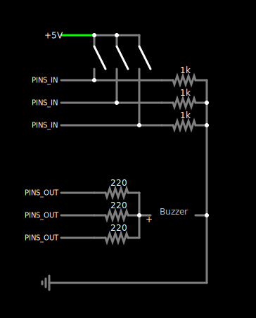

This is a proof-of-concept that an Arduino can play multiple tones after all.
No fancy hardware or software needed.

## Problem

Arduino has the
[`tone()` function](https://www.arduino.cc/reference/en/language/functions/advanced-io/tone/)
built-in for emitting a _single_ 50% duty cycle square wave on a pin, which can then be hooked up to a buzzer.
It, however, cannot manage multiple frequencies simultaneously, be it on one pin or multiple.

> Only one tone can be generated at a time.
> If a tone is already playing on a different pin, the call to `tone()` will have no effect.

## Solution

Instead of using `tone()` for additional concurrent frequencies, I repurposed the PWM of
[`analogWrite()`](https://www.arduino.cc/reference/en/language/functions/analog-io/analogwrite/)
as two additional simultaneous tones.
The PWM is also square wave, but with the duty cycle configurable rather than the frequency.
Using PWM at 50% duty cycle produces a wave equivalent to that from `tone()`.

With three square waves generated concurrently,
all it takes is a simple passive voltage averager to combine them to my single Piezo.
Note that Arduino is capable of current sinking, according to the
[digital pins page](https://docs.arduino.cc/learn/microcontrollers/digital-pins),
thus supports an averager circuit built with 220Ω resistors (5V ÷ 220Ω = 22&zwnj;8⁄11mA).

> Atmega pins can source (provide positive current) or sink (provide negative current)
> up to 40 mA (milliamps) of current to other devices/circuits.

Of course, the PWM is stuck at the hardware frequencies – 490 and 980 Hz. But hey, better than nothin’.

## Building

First, double check the PWM pins on your Arduino on the
[`analogWrite()`](https://www.arduino.cc/reference/en/language/functions/analog-io/analogwrite/)
page. This program uses a 490Hz PWM pin, a 980Hz PWM pin, and any third digital pin for a `tone()` call at 245Hz.
According to that page, the boards that PWM at these frequencies are
Uno, Nano, Micro, Mini, Mega, Yún, Leonardo and 101.

With that confirmed, construct the circuit as depicted below.
Use the pin numbers declared at the top of [`Arduino-Three-Tones.ino`](Arduino-Three-Tones.ino)
for `PINS_OUT` and `PINS_IN`, or update them with to the pin numbers you used. (I have an Uno.)

Then, flash the program to the Arduino. Pressing a button will toggle its corresponding tone between playing and muted.

## License

Copyright ParadoxV5 2022.
Distributed under the [Boost Software License, Version 1.0](https://www.boost.org/users/license.html).